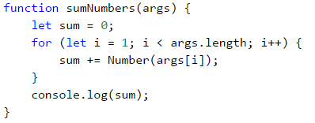
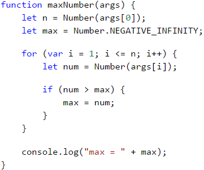
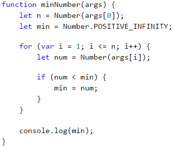
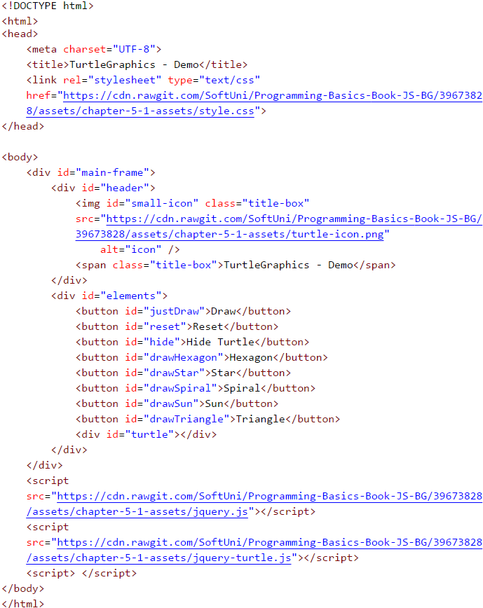
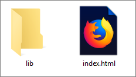
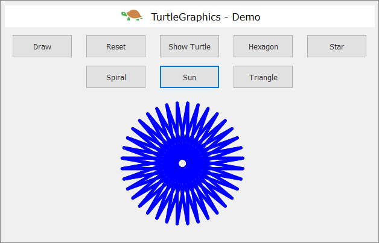

# Chapter 5.1. Loops (Repetitions)

In this chapter, we will introduce the **repeat blocks of commands**, also known as "**loops**". We will write a set of loops, using the **`for`** operator in its simplest form. Finally, we will solve a few practical problems that require repetition of commands, using loops.

## Repeating Code Blocks (For Loops)

In programming, we often need **to execute a block of commands multiple times**. To do that we use **loops**. Let's look at one example of a **`for` loop**, which will loop through the numbers from 1 to 10 and print each one:

```js
for (let i = 1; i <= 10; i++) {
    console.log("i = " + i);
}
```

The loop starts with the **operator `for`** and loops through all values of a given variable in a given range, for example, all numbers from 1 to 10 included. For each value, it executes a sequence of commands.

Upon declaring the loop you can specify a **start value** and an **end value**. **The loop's body** is usually in curly braces **`{ }`** and contains one or more commands. The figure below shows the structure of a **`for` loop**:


A **`for` loop** often circles **`1`** to **`n`** times (for example 1 to 10). The goal is to **loop** through the numbers 1, 2, 3, …, n sequentially and after each pass through the loop to **perform a certain action**. In the example above the variable **`i`** holds values from 1 to 10 and the current value is printed in the loop's body. The loop repeats 10 times and each of these repetitions is called an "**iteration**".

### Problem: Numbers from 1 to 100

Write a program that **prints the numbers from 1 to 100**. The program does not accept input and prints the numbers from 1 to 100 sequentially, each on a separate line.

#### Hints and Guidelines

We can solve this problem with a **`for` loop** which will pass through the numbers from 1 to 100 using the variable **`i`** and will print the numbers in the loop's body:


**Start** the program with [**Ctrl+F5**] and **test** it:


#### Testing in The Judge System

Test your solution here: [https://judge.softuni.org/Contests/Practice/Index/933#0](https://judge.softuni.org/Contests/Practice/Index/933#0).

You should get **100 points** (completely correct solution).


## Code Snippet for a For loop in Visual Studio Code

While programming, we often need to use loops, dozens of times a day. That's why in most development environments (IDE) there are **code snippets** for writing loops. An example of such a snippet is the **snippet for a `for` loop in Visual Studio Code**. Write **`for`** in the JavaScript code editor in Visual Studio Code and **hit** [**Tab**]:


 **VS Code** will open a snippet and write a complete **`for` loop**:


**Try it yourself**, so you can master the skill of using the code snippet for the **`for` loops** in Visual Studio Code.

### Problem: Numbers Ending in 7

Write a program that finds all numbers ending in 7 in the range [**1 … 1000**]. 

#### Hints and Guidelines

We can solve this problem by combining a **`for` loop** that loops through the numbers from 1 to 1000 and a **conditional statement** that checks if the number ends in 7. Of course, there are other options, too, but let's solve the problem using a **for loop + conditional statement**:


#### Testing in The Judge System

Test your solution here: [https://judge.softuni.org/Contests/Practice/Index/933#1](https://judge.softuni.org/Contests/Practice/Index/933#1).

### Problem: Latin Letters

Write a program that prints the letters from the alphabet: **a, b, c, …, z**.

#### Hints and Guidelines

We can solve this problem using a **`for` loop**, that loops through all letters' code numbers. Keep in mind that the code of the letter (the serial number in the [Unicode list of letters and characters](https://unicode-table.com/en/)\) ‘`a`’ is 97, the code of the letter ‘`b`’ is 98 and so on, and the code of the letter ‘`z`’ is 122. The transition from the number of the character to the letter itself is done with the help of the function `String.fromCharCode(x)`. Here's the example:


If we want to make the code easier to read, we can write the following:


#### Testing in The Judge System

Test your solution here: [https://judge.softuni.org/Contests/Practice/Index/933#2](https://judge.softuni.org/Contests/Practice/Index/933#2).

### Problem: Sum Numbers

Write a program that **sums `n` given integer numbers**.

* The first line of the input holds the number of integers **`n`**.
* Each of the following **`n`** lines holds a number to sum.
* Sum up the numbers and finally print the sum.

#### Sample Input and Output

| Input | Output |
| --- | --- |
| 2<br>10<br>20 | 30 |
| 3<br>-10<br>-20<br>-30 | -60 |
| 4<br>45<br>-20<br>7<br>11<br> | 43 |
| 1<br>999 | 999 | 
| 0 | 0 |

#### Hints and Guidelines

We can solve the problem by summing up numbers in the following way:
 - Read the input number **`n`**.
 - We start with a sum that initially equals zero **`sum = 0`**.
 - We run a loop from 1 to **`args.length`**. On each step of the loop, we read the number **`args[i]`** and add it to the **`sum`**.
 - Finally, we print the calculated **`sum`**.
 
Here's the source code for the solution:



#### Testing in The Judge System

Test your solution here: [https://judge.softuni.org/Contests/Practice/Index/933#3](https://judge.softuni.org/Contests/Practice/Index/933#3).

### Problem: Max Number

Write a program that reads **n integer numbers** (**n** > 0) and finds **the biggest** among them. The first line of the input specifies the number of integers **n**. The next **n** lines hold the numbers, one per line. Examples:

#### Sample Input and Output

| Input | Output |
| --- | --- |
| 2<br>100<br>99 | 100 | 
| 3<br>-10<br>20<br>-30 | 20 |
| 4<br>45<br>-20<br>7<br>99<br> | 99 | 
| 1<br>999 | 999 |
| 2<br>-1<br>-2 | -1 |

#### Hints and Guidelines

First, we read one number **`n`** (the number of integers that will be entered). We assign an initial neutral value to the current maximum **`max`**, for example **-1000000** (or **`Number.NEGATIVE_INFINITY`**). Using a **`for` loop** that iterates **n times** (**`n = args[0]`**), we read one integer number **`num`** on each iteration. If the current number **`num`** is higher than the current maximum **`max`**, we assign the value of the **`num`** to the variable **`max`**. Finally, we have the highest number's value stored in **`max`**. We print the number on the console.



#### Testing in The Judge System

Test your solution here: [https://judge.softuni.org/Contests/Practice/Index/933#4](https://judge.softuni.org/Contests/Practice/Index/933#4).


### Problem: Min Number

Write a program that reads **n integer numbers** (**n** > 0) and finds **the smallest** among them. First, read the number of integers **n**, then **n** numbers, one per line. 

#### Sample Input and Output

| Input | Output | 
| --- | --- |
| 2<br>100<br>99 | 99 |
| 3<br>-10<br>20<br>-30 | -30 |
| 4<br>45<br>-20<br>7<br>99<br> | -20 |

#### Hints and Guidelines

The problem is completely identical to the previous one, except this time we will use another neutral value for a start.



#### Testing in The Judge System

Test your solution here: [https://judge.softuni.org/Contests/Practice/Index/933#5](https://judge.softuni.org/Contests/Practice/Index/933#5).


### Problem: Left and Right Sum

Write a program that reads **2 \* n integer numbers** and checks whether **the sum of the first n integers** (left sum) equals **the sum of the second group of n integers** (right sum). In case the sums are equal, print **"Yes" + the sum**, otherwise print **"No" + the difference**. The difference is calculated as a positive number (by absolute value). The format of the output must be identical to the one in the examples below.

#### Sample Input and Output

| Input | Output | Input | Output |
| --- | --- | --- | --- | 
| 2<br>10<br>90<br>60<br>40 | Yes, sum = 100 | 2<br>90<br>9<br>50<br>50 | No, diff = 1 |

#### Hints and Guidelines

First, we read the number **n**, after that we enter the first **n** numbers (**the left** half) and calculate their sum. We will then proceed to read more **n** numbers (**the right** half) and sum them up. We calculate **the difference** between the sums by absolute value: **`Math.abs(leftSum - rightSum)`**. If the difference is **0**, print **"Yes" + the sum**, otherwise print **"No" + the difference**.


#### Testing in The Judge System

Test your solution here: [https://judge.softuni.org/Contests/Practice/Index/933#6](https://judge.softuni.org/Contests/Practice/Index/933#6).


### Problem: Odd Even Sum

Write a program that reads **n integer numbers** and checks whether **the sum of the numbers on even positions** equals **the sum of the numbers on odd positions**. In case the sums are equal, print **"Yes" + the sum**, otherwise print **"No" + the difference**. The difference is calculated by absolute value. The format of the output must be identical to the one in the examples below.

#### Sample Input and Output

| Input | Output |
| --- | --- |
| 4<br>10<br>50<br>60<br>20 | Yes<br>Sum = 70 |
| 4<br>3<br>5<br>1<br>-2 | No<br>Diff = 1 |
| 3<br>5<br>8<br>1 | No<br>Diff = 2 |

#### Hints and Guidelines

The program reads the numbers one by one and calculates the two **sums** (the sum of numbers on **even** positions and the sum of numbers on **odd** positions). We calculate the absolute value of the difference, like in the previous problem, and print the result (**"Yes" + the sum** in case the difference is 0 or **"No" + the difference** in any other case).


#### Testing in The Judge System

Test your solution here: [https://judge.softuni.org/Contests/Practice/Index/933#7](https://judge.softuni.org/Contests/Practice/Index/933#7).


### Problem: Vowels Sum

Write a program that reads a **text** (string), calculates and prints **the sum of the vowels' value** according to the table below:

| a | e | i | o | u | 
| :---: | :---: | :---: | :---: | :---: |
| 1 | 2 | 3 | 4 | 5 |

#### Sample Input and Output

| Input | Output | Input | Output | 
| --- | --- | --- | --- |
| hello | 6<br>(e+o = 2+4 = 6) | bamboo | 9<br>(a+o+o = 1+4+4 = 9) |
| hi | 3<br>(i = 3) | beer | 4<br>(e+e = 2+2 = 4) |

#### Hints and Guidelines

We read the text input **`arg1`**, then create a sum that equals zero and run a loop from **0** to **`input.length`** (the text's length). Check whether each letter **`input[i]`** is a vowel and add its value to the sum.


#### Testing in The Judge System

Test your solution here: [https://judge.softuni.org/Contests/Practice/Index/933#8](https://judge.softuni.org/Contests/Practice/Index/933#8).


## What Have We Learned from This Chapter?

We can repeat a block of code using a **`for` loop**:


We can perform various mathematical operations:


## Problems: Loops (Repetitions)

Now that we got acquainted with the loops, it's time **to consolidate our knowledge in practice**, and as you know, this is done with a lot of code writing. Let's solve several problems for exercise:

### Problem: Half Sum Element

Write a program that reads **n integer numbers** and checks whether there is a number that equals the sum of all the rest among them. If there is such an element, print **"Yes" + the element's value**, otherwise - **"No" + the difference between the largest element and the sum of the rest** (by absolute value). 

#### Sample Input and Output

| Input | Output | Comment |
| --- | --- | :---: |
| 7<br>3<br>4<br>1<br>1<br>2<br>12<br>1 | Yes<br>Sum = 12 | 3 + 4 + 1 + 2 + 1 + 1 = 12 |
| 4<br>6<br>1<br>2<br>3 | Yes<br>Sum = 6 | 1 + 2 + 3 = 6 |
| 3<br>1<br>1<br>10 | No<br>Diff = 8 | &#124;10 - (1 + 1)&#124; = 8 |
| 3<br>5<br>5<br>1 | No<br>Diff = 1 | &#124;5 - (5 + 1)&#124; = 1 |
| 3<br>1<br>1<br>1 | No<br>Diff = 1 | - |

#### Hints and Guidelines

Calculate **the sum** of all elements, find **the biggest** among them, and check the condition.

#### Testing in The Judge System

Test your solution here: [https://judge.softuni.org/Contests/Practice/Index/933#9](https://judge.softuni.org/Contests/Practice/Index/933#9).


### Problem: Odd / Even Position

Write a program that reads **n numbers** and calculates **the sum**, **the min** and **the max** value of the numbers on **even**, and **odd** positions (counting from 1). If no min / max element exists, print **"No"**. 

#### Sample Input and Output

| Input | Output | Input | Output |
| --- | --- | --- | --- |
| 6<br>2<br>3<br>5<br>4<br>2<br>1 | OddSum=9,<br>OddMin=2,<br>OddMax=5,<br>EvenSum=8,<br>EvenMin=1,<br>EvenMax=4 | 2<br>1.5<br>-2.5 | OddSum=1.5,<br>OddMin=1.5,<br>OddMax=1.5,<br>EvenSum=-2.5,<br>EvenMin=-2.5,<br>EvenMax=-2.5 |
| 1<br>1 | OddSum=1,<br>OddMin=1,<br>OddMax=1,<br>EvenSum=0,<br>EvenMin=No,<br>EvenMax=No | 0 | OddSum=0,<br>OddMin=No,<br>OddMax=No,<br>EvenSum=0,<br>EvenMin=No,<br>EvenMax=No |
| 5<br>3<br>-2<br>8<br>11<br>-3 | OddSum=8,<br>OddMin=-3,<br>OddMax=8,<br>EvenSum=9,<br>EvenMin=-2,<br>EvenMax=11 | 4<br>1.5<br>1.75<br>1.5<br>1.75 | OddSum=3,<br>OddMin=1.5,<br>OddMax=1.5,<br>EvenSum=3.5,<br>EvenMin=1.75,<br>EvenMax=1.75 |
| 1<br>-5 | OddSum=-5,<br>OddMin=-5,<br>OddMax=-5,<br>EvenSum=0,<br>EvenMin=No,<br>EvenMax=No | 3<br>-1<br>-2<br>-3 | OddSum=-4,<br>OddMin=-3,<br>OddMax=-1,<br>EvenSum=-2,<br>EvenMin=-2,<br>EvenMax=-2 |

#### Hints and Guidelines

The problem combines some of the previous problems: finding **the min**, **the max** value, and **the sum**, as well as processing the elements on **even and odd positions**. Check them out.

In this problem, it's better to work with **fractions** (not integers). The sum, the minimum, and the maximum value are also fractions. We must use **a neutral start value** upon finding the minimum / maximum, for example **1000000.0** and **-1000000.0**. If the final result is the neutral value, print **“No”**.

#### Testing in The Judge System

Test your solution here: [https://judge.softuni.org/Contests/Practice/Index/933#10](https://judge.softuni.org/Contests/Practice/Index/933#10).

### Problem: Equal Pairs

There are **2 \* n numbers**. The first and the second number form **a pair**, so do the third and the fourth number, and so on. Each pair has **a value** – the sum of its numbers. Write a program that checks **whether all pairs have the same value**.

In case the value is the same, print **"Yes, value=…" + the value**, otherwise, print **the maximum difference** between two consecutive pairs in the following format - **"No, maxdiff=…" + the maximum difference**. 

The input holds the number **n**, followed by **2*n integers**, all of them on a separate line.

#### Sample Input and Output

| Input | Output | Comment |
| --- | --- | :---: | 
| 3<br>1<br>2<br>0<br>3<br>4<br>-1| Yes, value=3 | values = {3, 3, 3}<br>same values | 
| 2<br>1<br>2<br>2<br>2 | No, maxdiff=1 | values = {3, 4}<br>difference = {1}<br>max. difference = 1 |
| 4<br>1<br>1<br>3<br>1<br>2<br>2<br>0<br>0 | No, maxdiff=4 | values = {2, 4, 4, 0}<br>difference = {2, 0, 4}<br>max. difference = 4 |
| 1<br>5<br>5 | Yes, value=10 | values = {10}<br>only one value<br>same values |
| 2<br>-1<br>0<br>0<br>-1 | Yes, value=-1 | values = {-1, -1}<br>same values | 
| 2<br>-1<br>2<br>0<br>-1 | No, maxdiff=2 | values = {1, -1}<br>difference = {2}<br>max. difference = 2 |

#### Hints and Guidelines

Read the numbers from the input **in pairs**. For each pair calculate its **sum**. As we read the number pairs from the input, for each pair, except for the first one, we must calculate **the difference with the previous one**. To do that, we need to store the sum of the previous pair in a separate variable. Finally, find **the biggest difference** between the two pairs. If it is **0**, print **“Yes”** + the value, otherwise - **“No”** + the difference.

#### Testing in The Judge System

Test your solution here: [https://judge.softuni.org/Contests/Practice/Index/933#11](https://judge.softuni.org/Contests/Practice/Index/933#11).

## Lab: Graphics and Web Applications

In this chapter, we learned about **loops** as a programming construction that allows us to repeat a particular action or a group of actions multiple times. Now let's play with them. To do that, we will draw several figures, which consist of a large number of repetitive graphic elements, and this time we will not do it on the console, but in a graphical environment, using "**turtle graphics**". It will be interesting. And it's not complicated at all. Try it!

### Problem: Drawing with a Turtle – a Graphical Application (GUI)

The purpose of the next exercise is to play with a **drawing library**, also known as **turtle graphics**. We will build a graphical application in which we will **draw different shapes**, moving our **“turtle”** on the screen through commands like “move 100 positions forward”, “turn 30 degrees to the right”, “move 50 positions more forward”. The application will look something like this:


First, let's check out **the drawing concept “Turtle Graphics”**. Take a look at the following sources:

* Definition of “turtle graphics”: [https://wiki.c2.com/?TurtleGraphics](https://wiki.c2.com/?TurtleGraphics)
* Article on “turtle graphics” in Wikipedia: [https://en.wikipedia.org/wiki/Turtle_graphics](https://en.wikipedia.org/wiki/Turtle_graphics)

We will build the application, using the following technologies:
  - **HTML** language – to describe the user interface (drawing field and buttons).
  - **JavaScript** code – to implement the actions of the buttons.
  - JS library **[jQuery](https://jquery.com/)** – to facilitate access to the user's interface.
  - JS library **[jQuerу-Turtle](https://github.com/PencilCode/jquery-turtle)** – to implement screen drawing with the mechanics of “turtle graphics”.
  
There are two options to load all libraries and resources for our web application **Turtle Graphics**:

+ **Loading resources via CDN** (Content Delivery Network).

This option is suitable when we have a permanent internet connection. We need to make a standard HTML file (for example **index.html**) and write the following code in it:



All the necessary resources will be loaded automatically when the file is started and we can directly write our **JavaScript** code.

If for some reason you don't have permanent access to the Internet, you can use the second option:

+ **Loading Resources Locally**

You have to download all the necessary files and change a few lines in the HTML file. Start by creating a folder called **Turtle-Demo** and create the main **HTML file** and a subfolder for the necessary resources in it:



In the folder **"lib"** we need to put a few files that we can download from the book's online storage: [https://github.com/SoftUni/Programming-Basics-Book-JS-EN/tree/master/assets/chapter-5-1-assets](https://github.com/SoftUni/Programming-Basics-Book-JS-EN/tree/master/assets/chapter-5-1-assets)

For your convenience, we have put the files in an archive, easy to download **Turtle-Graphics-Demo-Files.zip**:


Let's take a look at each one of them:

> **jquery.js (version 2.0.3)**

One of the most popular JavaScript libraries which offers **speed and functionality** when working with HTML user interface. It changes the way we write code and plan its structure. Check out the tool at: [https://jquery.com](https://jquery.com/)

> **jquery-turtle.js (version 2.0.8)**

A plugin, written by **David Bau** for jQuery - **jQuery-turtle** which provides a set of features for the **graphic drawing** of the "turtle" type. Find detailed information and rules of use here: [https://github.com/davidbau/jquery-turtle](https://github.com/davidbau/jquery-turtle)

> **style.css**

A set of **design rules** in a separate file.

> **turtle-icon.png**

A **raster graphic**, which we use for a better presentation of the application.

Once we have put all files in one folder, we need to change the network address of the resources in our **HTML** file - **index.html**:


After this change, each time you start the file, the browser will load the files locally from the **"lib"** folder.

Now we can proceed to the fun part - **writing the JavaScript code** for the web application. It will be located in the last pair of **`script`** tags in the HTML file (`index.html`): 

```html
<script> </script>
```
The code with the functions of the application will be relatively short (about 70-80 lines) and so we don't need to put it into a new separate file. The important thing is to place it correctly in our HTML file.

<table><tr><td></td>
<td>It is recommended that all JavaScript files be placed at the end of the HTML document before the final <strong>"body"</strong> tag. This guarantees the faster loading of the page because we do not delay the rendering (processing) of its elements.</td>
</tr></table>

Always **insert the library file first** [**jquery.js**], then the one with the plugin code [**jquery-turtle.js**]. Only then we will write our code because it's based on the first two files. If we try to change their places, we will get errors and our application will not work properly.

The library **"jQuery"** allows us to manipulate **HTML** elements, using valid design selectors (**CSS**). We have to apply a specific syntax:
```js
$('#ID') or $('.Class')  
```
We can use the **HTML** element's name, **ID**, or its **class**. The selectors are always strings of text, so they are enclosed in single or double-quotes. If the selector is the **ID** (a separate name for each element), in the beginning, we put a **sharp sign** (**#**). But if we have decided to select **by class** (one name for multiple elements), then we write a **dot**.

Adhering to the **jQuery-turtle** documentation, we have to initialize our object and set the basic characteristics of the "turtle". With the following code we will determine **the size** of the graph (**`turtleScale`**) and **the speed** of movement (**`turtleSpeed`**):

```js
eval($.turtle());
$('#turtle').css('turtleScale', '2').css('turtleSpeed', '4');
```

Once we are done with the basis of our application, we have to write the functions for each button. To do that, we use the selectors (**ID**) of the objects that we have preset in the **HTML file**. We will share the code for the first three buttons to get you acquainted with the basic principles:

+ **"Draw" Button**

We attach a function to the element with an **ID** (selector) **"justDraw"**, which will be activated the moment you click on the button:

```js
$('#justDraw').click(function() {
    cg();
    for (let index = 0; index < 4; index++) {
        $('#turtle').pen('blue', '5')
        .lt(30).fd(150)
        .lt(120).fd(150)
        .lt(120).fd(150);
    }
});
```
First, **erase the graphs** with the function **`cg()`** (clear graphics) and **write** an elementary **loop** that repeats 4 times. We use the keyword **`let`** on purpose, to define the variable **`index`**. This way we guarantee the variable's autonomy for the specific loop and we can easily use the same name again.

On each iteration (repetition) we apply specific methods of movement with a certain value (turn to the left and move forward):

```js
.lt(30) // rotate to the left with an argument 30
.fd(150) // move forward with an argument 150
```

Using the chaining technique saves additional code writing:

```js
$('#turtle').pen('blue', '5').lt(30).fd(150).lt(120) ...
        
// which is a shorter version of the classic method:

$('#turtle').pen('blue', '5');
$('#turtle').lt(30);
$('#turtle').fd(150);
$('#turtle').lt(120);
$('#turtle').fd(150);
...       
```

+ **"Reset" Button**

Attach a function to the element with an **ID** (selector) **"reset"**, which will be activated at the moment of clicking:

```js
$('#reset').click(function() {
    window.location.reload();
});
```
With **`window.location.reload()`** we activate **reloading the window**, which resets its current state. It is important to note that the **`location`** is **a feature** of the object **`window`**, and **`reload()`** is **a method** of **`location`**.

+ **"Hide Turtle" Button**

Attach a function to the element with an **ID** (selector) **"hide"**, which will be activated on clicking the button:

```js
$('#hide').click(function() {
        $('#turtle').toggle();
        $(this).text(function(i, text) {
          return text === "Hide Turtle" ? "Show Turtle" : "Hide Turtle";
      });
});
```
We use a preset function from the library **jQuery - `toggle()`**. With its help, we can **hide and show** elements. Apart from that, we attach another function that **changes the button's text** when clicked. We have to use the keyword **`this`**. It plays an important role in the JavaScript language syntax and **our thoughts** we can replace it with **self/itself**. In this case, it is equal to the element **`hide`**, ie. **`this = #hide`**. We turn to the element itself and set a text changing function which is also activated each time the button is clicked.

Let's sum up the code we have written so far:

```html
<script>
eval($.turtle());
$('#turtle').css('turtleScale', '2').css('turtleSpeed', '4');

$('#reset').click(function() {
    window.location.reload();
});

$('#justDraw').click(function() {
    cg();
    for (let index = 0; index < 4; index++) {
        $('#turtle').pen('blue', '5')
        .lt(30).fd(150)
        .lt(120).fd(150)
        .lt(120).fd(150);
    }
});

$('#hide').click(function() {
        $('#turtle').toggle();
        $(this).text(function(i, text) {
          return text === "Hide Turtle" ? "Show Turtle" : "Hide Turtle";
      });
});
</script>
```

The only thing left to solve is the problem of automatically deleting the drawing field when a new button is clicked. We don't want the shapes to be drawn one over the other or to use the **Reset** button every time.

+ **Function `resetCanvas()`**

```js
function resetCanvas() {
    cg();
    home();
    $('#turtle').css('turtleScale', '2').css('turtleSpeed', '4');
}
```
Apply the preset functions in David Bau's plugin to **erase all graph elements** (**`cg()`**) and **move** the turtle to its **starting position** (**`home()`**). Then we set the initial settings of the **`turtle`** element once again. The whole function **`resetCanvas()`** is added at the beginning of each new function that will be attached to the other buttons.

**Example:**
```js
$('#drawSpiral').click(function() {
    resetCanvas();
    $('#turtle').css('turtleSpeed', '4');
    for (let index = 0; index < X; index++) {
        // replace "X" with an appropriate number
        // some code you need to add
    }
});
```
If you want, you can change the animation speed and the contour color by adding the new setting directly to the **`click(...)`** function and the function attached to it for each button:

```js
$('#turtle').css('turtleSpeed', '6').pen('red', '5');
```

### Problem: * Draw a Hexagon with The Turtle

Add a [**Hexagon**] button that draws a regular hexagon:


**Hint:**

Repeat 6 times the following in a loop:
* 60 degrees rotation.
* Move forward 90 steps.

### Problem: * Draw a Star with The Turtle

Add a [**Star**] button that draws a star with 5 beams (**pentagram**), as shown in the figure below:


**Hint:**

Change the color: **`$("#turtle").pen("green", "5")`** 

Repeat 5 times the following in a loop:
* Move forward 180 steps.
* 144 degrees rotation.

### Problem: * Draw a Spiral with The Turtle

Add a [**Spiral**] button that draws a spiral with 30 beams, as shown in the figure below:


**Hint:**

Draw in a loop by moving forward and rotating. In each step, increase gradually the length of the forward step with 5 and rotate 60 degrees.

### Problem: * Draw a Sun with The Turtle

Add a [**Sun**] button that draws a sun with 36 beams, as shown in the figure below:



**Hint:**
 
Repeat the following 36 times in a loop:
* Move forward 200 steps.
* 170 degrees rotation.

### Problem: * Draw a Spiral Triangles with The Turtle

Add a [**Spiral Triangle**] button that draws three triangles with 22 beams each, as shown in the figure below:


**Hint:**

Draw in a loop by moving forward and rotating. In each step, increase the length of the forward step by 10 and rotate 120 degrees. Repeat 3 times in another loop for the three triangles.

If you have difficulties with the problems above, ask for help in **SoftUni's discussion Reddit**: https://www.reddit.com/r/softuni/.
