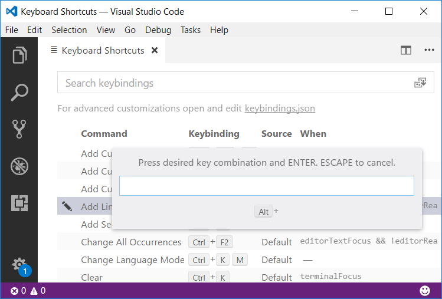
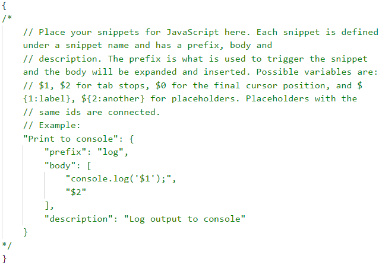
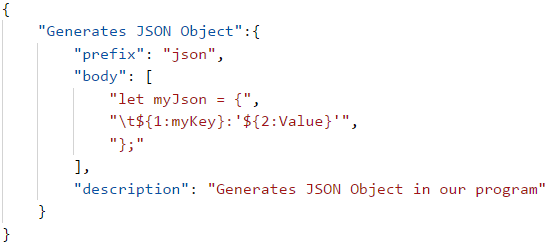
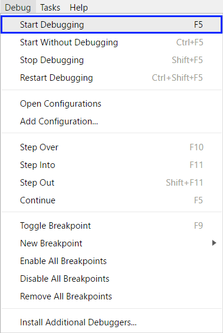

# Chapter 11. Tricks and Hacks

In the current chapter, we are going to see some tricks, hacks, and techniques, which will make our work with **JavaScript** easier in the **Visual Studio Code** IDE. In particular, we will see:

* How to properly **format our code**.
* Conventions for **naming elements in the code**.
* Some **keyboard shortcuts**.
* Some **code snippets**.
* Techniques to **debug our code**.

## Code Formatting

The right formatting of our code will make it **easier to read and understand** in case someone else needs to work with it. This is important because in practice we will need to work in a team with other people and it is highly important to write our code in a way that our colleagues can **quickly understand** it.

There are some defined rules for correct formatting of the code, which are collected in one place and are called **conventions**. The conventions are a group of rules, generally accepted by the programmers using a given language, which are massively used. These conventions help to build norms in given languages - what is the best way to write and what are the **good practices**. It is accepted that if a programmer follows them then his code is easy to read and understand.

The **JavaScript** language is created by **Brendan Eich** as part of the development of one of the first browsers **Netscape**. The basic constructions and basic syntax are intentionally **similar to Java**, to reduce the learning effort. Moreover, similar conventions are even used to write and format the code. You should know that, even if you do not follow the imposed conventions, the code will **work** (as long as it is written correctly), but simply **will not be easy to understand**. Of course, this is not fatal on a base level, but the faster you get used to writing quality code, the better.

The rules that are used for writing **JavaScipt** can be found in many sources. The official rules, etc. **JavaScript code conventions** are very well described in the article "**Coding style**" in the documentation of "Mozilla": [https://developer.mozilla.org/en-US/docs/Mozilla/Developer_guide/Coding_Style](https://developer.mozilla.org/en-US/docs/Mozilla/Developer_guide/Coding_Style). It is important, to note that in the examples, we have given so far and will give in the future in this book, we are guided mainly by it.

For code formatting **curly braces `{}`** to be opened on the same line and to be closed just below the construction, to which they refer, as in the example below.

```JavaScript
if (someCondition) {
    console.log("Inside the if statement");
}
```

You can see that the command **`console.log(…)`** in the example is **offset by 4 white spaces(one tab)**, which is also recommended by the documentation. If given construction with curly brackets is offset by one tab, then **the curly brackets `{}`** must be at **the beginning of the construction**, as in the example below:

```JavaScript
if (someCondition) {
   if (anotherCondition) {
       console.log("Inside the if statement");
   }
}
```

This is an example of a **badly formatted code** according to the accepted conventions for writing code in **JavaScript**:
   
```JavaScript
if(someCondition)
{
console.log("Inside the if statement");}
```

The first thing we can notice is the **curly braces `{}`**. The first (opening) bracket must be **exactly next to the `if` condition**, and the second (closing) bracket - **under the command `console.log(…)`, on a separate blank line**. In addition, the command inside the **`if`** construction must be **offset by 4 white spaces(one tab)**. Immediately after the keyword **`if`** and before the condition of the check, a **space** is left.

The same rule applies to **`for` loops, as well as any other constructions with curly braces `{}`**. Here are some more examples:

**Correct:**
```JavaScript
for (let i = 0; i < 5; i++) {
    console.log(i);
}
```
**Wrong:**
```JavaScript
for(let i=0;i<5;i++)
{
console.log(i);
}
```

For your comfort, there are **keyboard shortcuts in Visual Studio Code**, which we will explain later in this chapter, but for now, we are interested in the following combinations for formatting **the code in the whole document**:
* For Windows [**Shift + Alt + F**]
* For Mac [**Shift + Option + F**]
* For Ubuntu [**Ctrl + Shift + I**]

Let's use **the wrongly formatted example** from earlier:

```JavaScript
for(let i=0;i<5;i++)
{
console.log(i);
}
```

If we press [**Shift + Alt + F**], which is our combination to format **the entire document**, we will get code formatted according to **generally accepted JavaScript conventions**. 
However, automatic formatting does not affect the naming of our variables, which we have to take care of ourselves. It is accepted for variables to **begin** always **with a lowercase letter** and **contain lowercase letters**, with **each subsequent word** in them **beginning with a capital letter** (this naming is also known as the **`camelCase`** convention).
* We must be aware of uppercase and lowercase letters because **JavaScript makes a difference** between them. For example **`age`** and **`Age`** are different variables.
* Variable names **cannot** match a JavaScript keyword, for example, **`let`** is an invalid variable name. The official or, etc. keyword phrases are just words that are **part of the syntax of JavaScript** and for this reason, they are reserved and cannot be used as names of our variables. Through these words, we have the opportunity to build our programs. As an example of such words can be given the already used: **`for`**, **`while`**, **`do`**, **`if`**, **`else`**, **`let`**, etc. You can see a full list of these reserved phrases here: [https://developer.mozilla.org/en-US/docs/Web/JavaScript/Reference/Lexical_grammar#Keywords](https://developer.mozilla.org/en-US/docs/Web/JavaScript/Reference/Lexical_grammar#Keywords)

<table><tr><td></td>
<td>Although using the symbol <code><b>_</b></code> in the manes of variables is allowed, in JavaScript it is not recommended and is considered a bad style of naming.</td>
</tr></table>

Here are some examples for **well-named** variables:

* **`firstName`**
* **`age`**
* **`startIndex`**
* **`lastNegativeNumberIndex`**

Here are some examples for **badly named variables**, even though the names are correct according to the JavaScript language:

* **`_firstName`** (start with '\_')
* **`last_name`** (contains '\_')
* **`AGE`** (written in uppercase)
* **`Start_Index`** (starts with an uppercase letter and contains '\_')
* **`lastNegativeNumber_Index`** (contains '\_')

At a first look all these rules can seem meaningless and unnecessary, but with time passed and experience gaining you will see the need for conventions for writing quality code, to be able to work more easily and faster in a team. You will understand that the work with a code, which is written without complying with any rules for code quality, is annoying.

## Shortcuts in Visual Studio Code

In the previous section, we mentioned some of the combinations, that are used for formatting code. One of them [**Shift + Alt + F**] is used for **formatting the whole code in a file**, and others did the same thing but on a different operating system. These combinations are called **shortcuts** and now we will give more thorough information about them.

Shortcuts are **combinations**, that give us the ability to perform some actions **easier and faster**, and each software development environment has its shortcuts, although most are repetitive. We will now look at some of the **shortcuts** in **Visual Studio Code**. The listed keyboard shortcuts work for sure and have been tested on Windows. The idea is to show you that this exists, it is easy to use and when needed, you can always find what you need for every operating system.

| Combination | Action |
| --- | --- |
|  [**CTRL + F**] | The combination **opens the search window**, by which we can **search in our code**. |
|  [**CTRL + /**] | **Comments** part of our code and accordingly **removes the comment** which is already commented. |
|  [**CTRL + Z**] | **Brings back one change** (so-called Undo). |
|  [**CTRL + Y**] | The combination is opposite of [**CTRL + Z**] (the so-called Redo). |
|  [**Shift + Alt + F**] | **Formats the code** according to the default conventions. |
|  [**CTRL + Backspace**] | **Deletes** the word to the left of the cursor. |
|  [**CTRL + Del**] | **Deletes** the word to the right of the cursor. |
|  [**CTRL + K S**] | **Saves** all files in the project. |
|  [**CTRL + S**] | **Saves** the current file. |

More about the **shortcuts in Visual Studio Code** can be found here: [https://code.visualstudio.com/shortcuts/keyboard-shortcuts-windows.pdf](https://code.visualstudio.com/shortcuts/keyboard-shortcuts-windows.pdf). 

If you feel confident enough about your shortcut skills, open **Visual Studio Code** and press [**CTRL + K + S**] (note that this is different from [**CTRL + K S**], where **Ctrl** and **K** are pressed simultaneously, and **S** after that), which will open a window in the development environment itself, which contains a complete list of all possible keys combinations in the world of **Visual Studio Code**. Moreover, even from there, you will be able to make **changes** to existing keyboard shortcuts:



Do not hesitate, apply what you have learned now and use the keyboard shortcuts that you think will help you in writing your programs!

## Code Snippets (Code Snippets)

In **Visual Studio Code** there are the so-called **code snippets** (code snippets), which write a block of code by using a code template. This useful option is not enabled by default. You have to activate it yourself from [**File -> Preferences -> Settings**] (or just **[Ctrl + Comma]**), which opens window called **User Settings**. These are your settings, that you can easily change. Just add the following line between the opening and closing curly braces on the right side of the screen:

    "editor.tabCompletion": true

After doing this, when you type "**`for`**" and press **[Tab]** + **[Tab]**, the code of **complete `for` loop** is automatically generated in the body of our program. This is called "unfolding a code snippet". The snippet "**`if`**" + **[Tab]** + **[Tab]** works similarly. On the figure below you can see the "**`for`**" snippet in action:


### Creating Your Code Snippet

In this section, we are going to show you how to **make your code snippet**. We will see **how to make a code snippet** for **`json`** object. For a start, we will go to [**File -> Preferences -> User Snippets**], then a window will open from which you can choose for which programming language you will create a snippet, as shown in the picture:

 

**We choose JavaScript** from the drop-down menu and a window with a name will open **JavaScript.json**. This extension **json** is a special format for saving data, which is imposed in the ways of data transfer and storage. In addition, the **json** format can be used in our programs, as we will discuss later. The file looks like this:

 

The example we see by default is generating code to write to the console using the **log** key prefix. This code is just an example, and this template is embedded, but if it wasn't, it would look like the example.

In this example, you see a lot of unknown things, but do not worry, we will get familiar with them later. We now focus on the part **`"Print to console":`** and the code between **opening and closing curly braces `{}`**. What we see inside the parentheses is the content of a template. . Each template must contain a **`prefix`**, which is the short text that after pressing [**Tab**] + [**Tab**] will generate the template code in your program.

The second thing your template should have is a **`body`**, this is the most complex part of the template. This is the ** code that will be generated ** and in it, we can use **variables**, which are created with **`$1`**, and in place of the unit can be placed other text. The example uses a variable: **`"console.log('$1');"`**.

We can use **Tabstops**, which simply **place the cursor in certain places in the code**, and between them can be navigated with tabs. They are created automatically by creating a variable. We can also use **Placeholders**, they are a type of **Tabstops**, but they can also **contain some value**, for example: **`${1:myVal}`**.

There are also more complex configurations, but for begging these will do an excellent job.

The last part of the template is a **`description`**, which serves to add an explanation of what it does. Now let's try to make our template. We delete the given example and enter the following code:

 

Now when we type **`json`** + [**Tab**] + [**Tab**] in an open JavaScript file in Visual Studio Code, **our new snippet** appears:

 

For those of you who are more interested in the topic, many of the big **frameworks** like **Angular, React, etc.** have their own templates that can be installed from the **Extensions** window. As the name suggests, a **framework** is a conceptual structure that helps us by giving us some things in advance, and also prevents us from making big mistakes by imposing certain restrictions. The main idea is to provide a complete solution in a given area, which can upgrade all components in this area. Some of the things you can get ready-made are these templates.

 

## Code Debugging Techniques

Debugging plays an important role in the process of creating software, which is to allow us to **follow the implementation of our program step by step**. With this technique, we can **follow the values of the local variables** because they are changing during the execution of the program and **remove** possible **errors** (bugs). The process of debugging includes:

* **Finding** the problems (bugs).
* **Locating** the code, which causes the problems.
* **Correcting** the code, which causes the problems so that the program works correctly.
* **Testing**, to make sure that the program works correctly after the corrections we have made.

**Visual Studio Code** gives us **a built-in debugger**, thanks to which we can place **breakpoints**, at places we have chosen. When it reaches a **breakpoint**, the program **stops running** and allows **step-by-step running** of the remaining lines. Debugging allows us to **get the details of the program** and see where exactly the errors occur and what is the reason for this.

To demonstrate how to use the debugger, we will use the following program:

```JavaScript
for (let i = 0; i < 100; i++) {
    console.log(i);
}
```

We will place a **breakpoint** on the method **`console.log(…)`**. For this, we will need to move our cursor to the line, which prints on the console, and press [**F9**]. A **breakpoint** (the red point, just before the number on line 3), where the program will **stop** its execution:

 

To start **the program in debug mode**, we choose [**Debug**] -> [**Start Debugging**] or press [**F5**]:

 

After starting the program, we can see that it **stops executing** at line 4, where we placed our breakpoint. The code in the current line **is colored in yellow** and we can **run it step by step**. To go to **the next line** e use the key [**F10**]. **We can see that the code on the current line hasn't been executed yet**. **It will execute when we go ahead to the next line**:

 

From the **Debug** window, which opens with [**View -> Debug**] or with the keyboard shortcut [**Ctrl + Shift + D**], we can observe **the changes in the local variables**. 

 

## A Guide for Tricks

In this section, we will briefly show **tricks and techniques** of programming with the **JavaScript** language, some of which are already mentioned in this book, which will be very useful, if you take a programming exam for beginners.

### Rounding Numbers
In case we need to round numbers we can use one of the following methods:

 * **`Math.round(…)`** - accepts 1 parameter - **number, which we want to round**. Rounding is performed according to the basic rule of rounding - if the decimal part is less than 5, rounding is down and vice versa, if it is greater than 5 - up:

```JavaScript
let number = 5.439;
console.log(Math.round(number));
// This will print on the console "5"
let secondNumber = 5.539;
console.log(Math.round(secondNumber));
// This will print on the console "6"
```


 * **`Math.floor(…)`** - in case we want the rounding always to be **down to the previous integer**. For example, if we have the number 5.99 and use ** `Math.floor (5.99)` **, we get the number **5**:

```JavaScript
let numberToFloor = 5.99;
console.log(Math.floor(numberToFloor));
// This will print on the console 5
```

 * **`Math.ceil(…)`** - in case we want the rounding always to be **up to the previous integer**. For example, if we have the number 5.13 and use **`Math.ceil(5.13)`**, we
 * will get the number **6**:

```JavaScript
let numberToCeil = 5.13;
console.log(Math.floor(numberToCeil));
// This will print on the console 6
```

 * **`Math.trunc(…)`** - in case we want to **remove the fractional part**. For example, if we have the number 2.63 and use **`Math.trunc(2.63)`**, we will get the number **2**:

```JavaScript
let numberToTrunc = 2.63;
console.log(Math.floor(numberToTrunc));
// This will print on the console 2
```

### Use === Instead of ==, and !== Insted of !=

The operators **`==`** and **`!=`** make **automatic conversion** of the compared value or variable, while the operators **`===`** and **`!==`** does not make such a conversion and if both values are not of the same type - the result is **`false`**. They (**`==`** and **`!=`**) make a comparison of **value and type**, which is more accurate and even faster. Let's look at the following example to clarify what is meant by data **type**:

```JavaScript
[10] === 10    // false
[10] == 10    // true
"10" == 10     // true
"10" === 10    // false
 [] == 0     // true
 [] === 0     // false
 "" == false   // true but true == "a" is false
 "" === false // false 
```

We see how the number **10** can be written in our programs in different ways. Written in this way **`[10]`** is an **array** of one number. In short, arrays are **multiple values** stored to a variable. For example:

```JavaScript
let array = [10, 20, 30, 40];
// This is a variable of type array
```

We will learn more about arrays later but for now, let's just think about whether the array **`[10]`** is normally equal to the number **`10`**. We will give you a hint - **it is not normal**. Therefore, if we do not want unpleasant errors (bugs) in our programs, it is best to use the operators  **`===`** and **`!==`**.

The situation with other comparison operators is similar and the same logic applies there.

### How to Write a Conditional Statement?

The conditional **`if` statement** contains the following elements:

* Keyword **`if`**
* **A Boolean expression** (condition)
* **Body** of the conditional construction
* Optional: **`else` clause**

```JavaScript
if (condition) {
    // body
}
else (condition) {
    // body
}
```

To make it easier we can use a code snippet for an **`if` construction**: **`if`** + [**Tab**] + [**Tab**].

### How to Write a 'For' Loop?

For a **`for` loop** we need a couple of things:

* Initializing block, in which the counter variable is declared (**`let i`**) and its initial value is set.
* Condition for repetition (**`i <= 10`**).
* Updating statement (**`i++`**).
* Body of the loop.

```JavaScript
for (let i = 0; i <= 10; i++;) {
    // body
}
```

To be easier to write it, we can use the code snippet for the **`for` loop**: **`for`** + [**Tab**] + [**Tab**].

### Using The So-Called Positive (Truthy) and Negative (Falsy) Value

All **Truthy** values used in the **`if`** conditional statement will give a positive result and accordingly or program will continue ist execution in the body of the conditional statement (for the example here the body of the conditional statement is not formatted correctly).

For some of them it seems logical to give a positive result, but for others not so much.

```JavaScript
//Truthy
if (true) {}       //true
if ({}) {}         //true
if ([]) {}         //true
if (42) {}         //true
if ("foo") {}      //true
if (new Date()) {} //true
if (-42) {}        //true
if (3.14) {}       //true
if (-3.14) {}      //true
if (Infinity) {}   //true
if (-Infinity) {}  //true
```
Conversely, all **Falsy** values will give a negative result and the program will not enter the body of the conditional statement.

```JavaScript
//Falsy
if (false) {}       //false
if (null) {}        //false
if (undefined) {}   //false
if (0) {}           //false
if (NaN) {}         //false
if ('') {}          //false
if ("") {}          //false
```

It is not necessary to know these values by heart at this stage, but only to remember that there are so-called **Truthy** and **Falsy** values. Over time, we will get used to how to use them properly and how they help us shorten our code. 

## What Have We Learned from This Chapter?

In the current chapter, we learned how to **correctly** **format** and **name** the elements of our code, some **shortcuts** for work in Visual Studio Code, some **code snippets**, and how to **debug code**.
